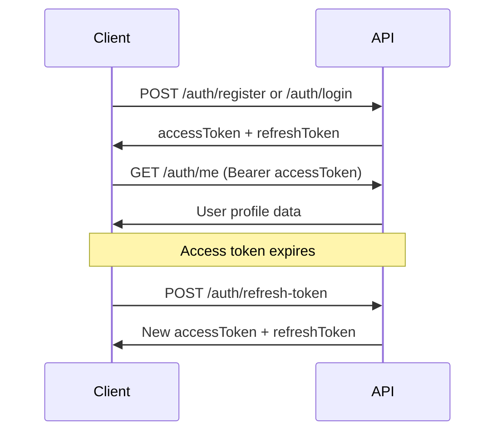

The Authentication API provides secure identity management for QeetMart applications. It handles user registration, login, session management, and profile operations using JWT-based authentication.

## Base URL

```
http://localhost:4001
```

## Authentication flow

The Authentication API uses a dual-token system for secure session management:

1. **Access Token** - Short-lived JWT token (included in `Authorization` header)
2. **Refresh Token** - Long-lived token for rotating access tokens

### Standard authentication flow



### Registration flow

1. Client submits email and password to `/auth/register`
2. Server creates user account with `CUSTOMER` role
3. Server returns access token and refresh token
4. Email verification is pending (user can still authenticate)

### Login flow

1. Client submits credentials to `/auth/login`
2. Server validates credentials and account status
3. Server creates session with device tracking
4. Server returns JWT tokens for session

### Token refresh flow

1. Client detects access token expiration
2. Client submits refresh token to `/auth/refresh-token`
3. Server validates refresh token and session
4. Server rotates both tokens (old tokens invalidated)
5. Server returns new access token and refresh token

## JWT token structure

Access tokens are JWTs containing user claims:

```json
{
  "sub": "user@example.com",
  "userId": 12345,
  "role": "CUSTOMER",
  "iat": 1709435200,
  "exp": 1709438800
}
```

## Security headers

All authenticated endpoints require the `Authorization` header:

```
Authorization: Bearer <accessToken>
```

## Session tracking

The API tracks sessions using:

- **Device ID** - Optional client-provided identifier
- **User-Agent** - Browser/client information (from header)
- **IP Address** - Client IP (supports `X-Forwarded-For`)

These metadata fields are used for:
- Multi-device session management
- Security audit logging
- Selective logout (single device vs all devices)

## User roles

The Authentication API supports four user roles:

- `CUSTOMER` - Default role for registered users
- `VENDOR` - Marketplace seller accounts
- `ADMIN` - Administrative access
- `SUPER_ADMIN` - Full system access

## Account status

User accounts can have three status values:

- `ACTIVE` - Account is active and can authenticate
- `LOCKED` - Account is locked (returns 423 on login)
- `SUSPENDED` - Account is suspended

## Error handling

The API uses standard HTTP status codes:

| Status | Description |
|--------|-------------|
| `200` | Request successful |
| `201` | Resource created (registration) |
| `400` | Invalid request payload |
| `401` | Invalid credentials or unauthorized |
| `403` | Email not verified |
| `423` | Account locked |

All error responses follow this structure:

```json
{
  "success": false,
  "message": "Invalid credentials",
  "data": null,
  "timestamp": "2026-03-03T10:30:00Z"
}
```

## Rate limiting

Authentication endpoints implement rate limiting to prevent brute force attacks. Consider implementing:

- Login attempt throttling per IP address
- Registration limits per IP/email domain
- Token refresh frequency limits

## Next steps

<CardGroup cols={2}>
  <Card title="Endpoint reference" icon="code" href="/api/auth/endpoints">
    Detailed documentation for all authentication endpoints
  </Card>
  <Card title="Security best practices" icon="shield" href="/concepts/authentication">
    Learn how to secure your authentication implementation
  </Card>
</CardGroup>
