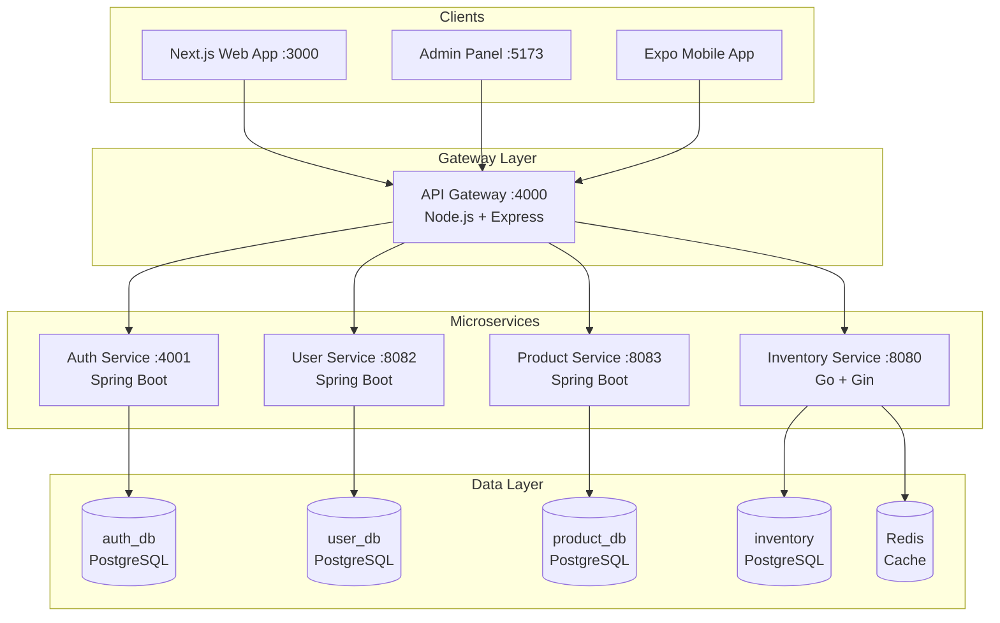

# Architecture overview

QeetMart implements a microservices architecture with an API Gateway pattern, polyglot service runtime, and contract-first API design.

## System architecture



## Core principles

<CardGroup cols={2}>
  <Card title="Service isolation" icon="cube">
    Each service has its own database, codebase, and deployment lifecycle. No shared databases.
  </Card>
  
  <Card title="Contract-first APIs" icon="file-contract">
    OpenAPI 3.0 specs define all service interfaces. Breaking changes are detected in CI.
  </Card>
  
  <Card title="Technology flexibility" icon="code">
    Services use the best tool for the job: Node.js for routing, Java for business logic, Go for performance.
  </Card>
  
  <Card title="Centralized gateway" icon="door-open">
    Single entry point handles auth, rate limiting, routing, and cross-cutting concerns.
  </Card>
</CardGroup>

## API Gateway

The API Gateway (micros/api-gateway/src/index.ts:1) is built with Node.js and Express, providing:

### Routing and proxying

Requests are routed to backend services based on path patterns:

```typescript
// From micros/api-gateway/src/config/services.ts
const routeConfig = [
  { path: '/api/v1/auth', service: 'auth', upstreamPath: '/auth' },
  { path: '/api/v1/users', service: 'users', upstreamPath: '/users' },
  { path: '/api/v1/products', service: 'products', upstreamPath: '/products' },
  { path: '/api/v1/inventory', service: 'inventory', upstreamPath: '/inventory' },
];
```

The gateway uses `http-proxy-middleware` to forward requests (micros/api-gateway/src/routes/gateway.routes.ts:39):

```typescript
const proxyOptions = {
  target: serviceConfig.baseUrl,
  changeOrigin: true,
  xfwd: true,
  pathRewrite: (proxyPath) => joinUpstreamPath(upstreamPath, proxyPath),
  timeout: 5000,
  on: {
    proxyReq: (proxyReq, req) => {
      // Forward correlation ID
      if (correlationId) {
        proxyReq.setHeader('x-correlation-id', correlationId);
        proxyReq.setHeader('x-request-id', correlationId);
      }
      // Forward JWT token
      if (req.token) {
        proxyReq.setHeader('authorization', `Bearer ${req.token}`);
      }
    }
  }
};
```

### Security middleware

Multiple security layers protect the gateway (micros/api-gateway/src/index.ts:22):

```typescript
// Helmet for HTTP security headers
app.use(helmet());

// CORS configuration
const corsOptions = {
  credentials: true,
  origin: (origin, callback) => {
    if (!origin || allowedOrigins.includes(origin)) {
      callback(null, true);
    } else {
      callback(new Error('CORS origin not allowed'));
    }
  },
};
app.use(cors(corsOptions));

// Rate limiting: 1000 requests/minute per IP
const limiter = rateLimit({
  windowMs: 60000,
  max: 1000,
  message: 'Too many requests from this IP, please try again later.',
});
app.use('/api/', limiter);
```

### Health monitoring

The gateway provides health check endpoints (micros/api-gateway/src/index.ts:56):

```typescript
// Gateway health
app.get('/health', (_req, res) => {
  res.json({
    status: 'ok',
    service: 'api-gateway',
    timestamp: new Date().toISOString(),
  });
});

// Downstream services health
app.get('/health/services', async (_req, res) => {
  const healthStatus = await checkServiceHealth();
  const allHealthy = healthStatus.every(s => s.status === 'healthy');
  
  res.status(allHealthy ? 200 : 503).json({
    status: allHealthy ? 'ok' : 'degraded',
    services: healthStatus,
    timestamp: new Date().toISOString(),
  });
});
```

## Microservices

### Auth Service (Spring Boot)

**Port**: 4001  
**Runtime**: Java 17 + Spring Boot  
**Database**: PostgreSQL (auth_db)  
**Purpose**: JWT authentication and authorization

**Key responsibilities**:
- User registration and login
- JWT token issuance and validation
- Password hashing and security
- Session management

**Configuration** (docker-compose.dev.yml:46):
```yaml
auth-service:
  build:
    context: micros/auth-service
  environment:
    SERVER_PORT: "4001"
    DB_HOST: auth-db
    DB_NAME: auth_db
    JWT_SECRET: CHANGE_ME_TO_A_32_BYTE_MINIMUM_SECRET_123456
    JWT_ISSUER_URI: http://auth-service:4001
  depends_on:
    auth-db:
      condition: service_healthy
```

### User Service (Spring Boot)

**Port**: 8082  
**Runtime**: Java 17 + Spring Boot  
**Database**: PostgreSQL (user_db)  
**Purpose**: User profile and preferences management

**Key responsibilities**:
- User profile CRUD operations
- Address management
- User preferences and settings
- Profile validation

### Product Service (Spring Boot)

**Port**: 8083  
**Runtime**: Java 17 + Spring Boot  
**Database**: PostgreSQL (product_db)  
**Purpose**: Product catalog management

**Key responsibilities**:
- Product catalog CRUD
- Category management
- Product search and filtering
- Pricing and metadata

### Inventory Service (Go)

**Port**: 8080  
**Runtime**: Go 1.23+ + Gin framework  
**Database**: PostgreSQL + Redis  
**Purpose**: Real-time inventory tracking with caching

**Key responsibilities**:
- Stock level tracking
- Inventory reservations with TTL
- Redis caching for high-performance reads
- Expiration worker for reservation cleanup

**Service initialization** (micros/inventory-service/cmd/main.go:24):

```go
func main() {
    logger := slog.New(slog.NewJSONHandler(os.Stdout, &slog.HandlerOptions{Level: slog.LevelInfo}))
    
    cfg, err := config.Load()
    if err != nil {
        logger.Error("failed to load config", "error", err)
        os.Exit(1)
    }
    
    // PostgreSQL connection pool
    dbPool, err := pgxpool.New(appCtx, cfg.DatabaseURL)
    if err != nil {
        logger.Error("failed to connect database", "error", err)
        os.Exit(1)
    }
    defer dbPool.Close()
    
    // Redis client
    redisClient := redis.NewClient(&redis.Options{
        Addr:     cfg.RedisAddr,
        Password: cfg.RedisPassword,
        DB:       cfg.RedisDB,
    })
    
    // Inventory service with reservation TTL
    service := services.NewInventoryService(
        repo, 
        redisClient, 
        logger, 
        cfg.ReservationTTL,
        cfg.ExpirationPollInterval,
    )
    service.StartExpirationWorker(appCtx)
}
```

**Why Go for inventory?**

<Note>
The inventory service uses Go for its exceptional concurrency model, low latency, and efficient memory usage - critical for real-time stock updates and reservation handling.
</Note>

## Data architecture

### Database per service pattern

Each service owns its database schema:

| Service | Database | Purpose |
| --- | --- | --- |
| Auth Service | `auth_db` | User credentials, tokens, sessions |
| User Service | `user_db` | User profiles, addresses, preferences |
| Product Service | `product_db` | Products, categories, pricing |
| Inventory Service | `inventory` | Stock levels, reservations |

<Warning>
Services **must not** directly query other services' databases. All inter-service communication happens through APIs.
</Warning>

### Caching strategy

The inventory service uses Redis for caching (docker-compose.dev.yml:152):

```yaml
inventory-redis:
  image: redis:7.2-alpine
  healthcheck:
    test: ["CMD", "redis-cli", "ping"]
    interval: 5s
    timeout: 3s
    retries: 20
```

**Cache usage**:
- Product stock levels (high read volume)
- Reservation state (TTL-based expiration)
- Frequent inventory queries

### Database migrations

Each service manages its own schema migrations:

- **Spring Boot services**: Use JPA with `JPA_DDL_AUTO=update` for development
- **Go inventory service**: SQL migration files in `micros/inventory-service/migrations/`

Docker Compose mounts initial schema (docker-compose.dev.yml:150):

```yaml
volumes:
  - ./micros/inventory-service/migrations/001_init.sql:/docker-entrypoint-initdb.d/001_init.sql:ro
```

## Communication patterns

### Request flow

1. **Client request** → API Gateway (port 4000)
2. **Gateway auth middleware** validates JWT token
3. **Gateway rate limiter** checks request quota
4. **Proxy middleware** routes to appropriate service
5. **Service processes** request and queries its database
6. **Response** flows back through gateway to client

### Service discovery

Services are discovered via environment variables (micros/api-gateway/.env.example:29):

```bash
AUTH_SERVICE_URL=http://localhost:4001
USER_SERVICE_URL=http://localhost:8082
PRODUCT_SERVICE_URL=http://localhost:8083
INVENTORY_SERVICE_URL=http://localhost:8080
```

In Docker Compose, service names resolve via internal DNS:

```yaml
environment:
  AUTH_SERVICE_URL: "http://auth-service:4001"
  USER_SERVICE_URL: "http://user-service:8082"
```

### Error handling

The gateway handles service failures gracefully (micros/api-gateway/src/routes/gateway.routes.ts:47):

```typescript
on: {
  error: (err, req, res) => {
    console.error(`Proxy error for ${path}:`, err.message);
    
    if (!res.headersSent) {
      res.status(502).json({
        success: false,
        error: {
          message: `Service ${serviceConfig.name} is unavailable`,
          code: 'SERVICE_UNAVAILABLE',
          correlationId: req.correlationId,
        },
      });
    }
  }
}
```

## Contract governance

QeetMart uses OpenAPI 3.0 specifications as the source of truth for all service APIs.

### OpenAPI specs location

All contracts live in `contracts/openapi/*.openapi.json`:

- `auth-service.openapi.json`
- `user-service.openapi.json`
- `product-service.openapi.json`
- `inventory-service.openapi.json`

### Contract validation

CI enforces contract rules:

```bash
# Lint OpenAPI specs for validity
pnpm contracts:lint

# Detect breaking changes
pnpm contracts:breaking
```

**Breaking changes** include:
- Removing API paths or operations
- Adding required request parameters
- Removing response fields
- Changing response status codes
- Deleting contract files

### TypeScript client generation

Type-safe clients are generated from OpenAPI specs:

```bash
pnpm docs:generate:clients
```

Output: `packages/openapi-clients/` with full TypeScript definitions.

## Deployment architecture

### Local development

Docker Compose provides the full stack:

```bash
pnpm docker:up  # Start all services
pnpm docker:down  # Stop and cleanup
```

### Kubernetes deployment

Kustomize overlays for each environment:

```
platform/k8s/
├── base/                    # Base manifests
│   ├── api-gateway.yaml
│   ├── auth-service.yaml
│   ├── user-service.yaml
│   ├── product-service.yaml
│   ├── inventory-service.yaml
│   └── ingress.yaml
└── overlays/
    ├── dev/                 # Development patches
    ├── staging/             # Staging configuration
    └── prod/                # Production configuration
```

Deploy to Kubernetes:

```bash
# Build manifests
kustomize build platform/k8s/overlays/prod > deployment.yaml

# Apply to cluster
kubectl apply -f deployment.yaml
```

### Helm deployment

Alternatively, use the Helm chart:

```bash
# Install to Kubernetes
helm install qeetmart ./helm/qeetmart \
  --namespace qeetmart \
  --create-namespace \
  --values helm/qeetmart/values-prod.yaml
```

## Scalability considerations

<CardGroup cols={2}>
  <Card title="Horizontal scaling" icon="arrows-left-right">
    Each service can scale independently based on load. API Gateway and services are stateless.
  </Card>
  
  <Card title="Database isolation" icon="database">
    Service-specific databases prevent bottlenecks and allow independent schema evolution.
  </Card>
  
  <Card title="Redis caching" icon="bolt">
    Inventory service caches frequently accessed data, reducing database load significantly.
  </Card>
  
  <Card title="Async processing" icon="clock">
    Inventory reservations use TTL-based expiration with background workers.
  </Card>
</CardGroup>

## Monitoring and observability

### Health checks

Each service exposes health endpoints:

- **Spring Boot services**: `/actuator/health`
- **Node.js Gateway**: `/health`
- **Go Inventory**: `/health`

The gateway aggregates service health at `/health/services`.

### Logging

All services use structured logging:

- **Node.js**: Console with request correlation IDs
- **Spring Boot**: Logback with JSON formatting
- **Go**: `slog` with JSON handler

### Request tracing

The gateway adds correlation IDs to all requests (micros/api-gateway/src/routes/gateway.routes.ts:69):

```typescript
proxyReq.setHeader('x-correlation-id', correlationId);
proxyReq.setHeader('x-request-id', correlationId);
```

These IDs flow through all services for distributed tracing.

## Security architecture

### Authentication flow

1. Client authenticates with Auth Service via Gateway
2. Auth Service validates credentials and issues JWT
3. Client includes JWT in `Authorization: Bearer <token>` header
4. Gateway validates JWT on every request
5. Gateway forwards valid token to downstream services

### JWT validation

The gateway validates JWTs before proxying (micros/api-gateway/.env.example:19):

```bash
JWT_SECRET=CHANGE_ME_TO_A_STRONG_BASE64_OR_RAW_SECRET
JWT_ISSUER=http://localhost:4001
```

All services share the same JWT secret for token validation.

<Warning>
**Never** commit real JWT secrets to version control. Use secret managers in production (AWS Secrets Manager, HashiCorp Vault, etc.).
</Warning>

### Network security

In Kubernetes:

- Services communicate via internal cluster DNS
- Only the API Gateway is exposed via Ingress
- Network policies restrict inter-service communication
- TLS terminates at the Ingress controller

## Next steps

<CardGroup cols={2}>
  <Card title="API reference">
    Explore the OpenAPI documentation for each service
  </Card>
  
  <Card title="Deployment guide">
    Learn how to deploy QeetMart to Kubernetes
  </Card>
  
  <Card title="Configuration reference">
    Detailed guide to all environment variables and configuration options
  </Card>
  
  <Card title="Development guide">
    Best practices for adding new features and services
  </Card>
</CardGroup>