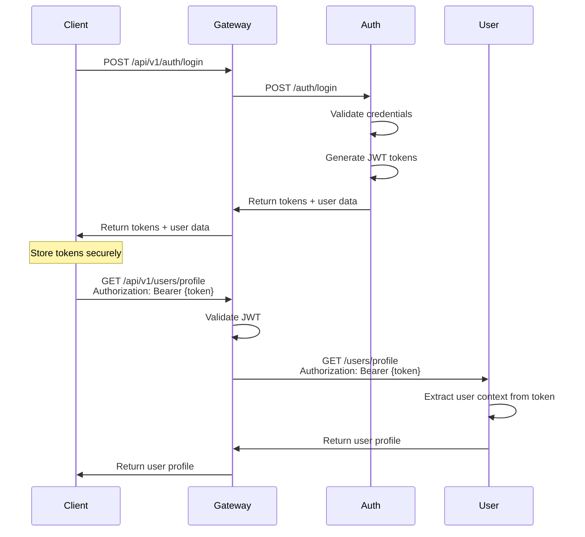

QeetMart uses **JWT (JSON Web Tokens)** with HMAC signing for stateless authentication. The auth service generates tokens, and the API Gateway validates them before forwarding requests to downstream services.

## Authentication flow

The authentication flow follows a standard OAuth2-inspired pattern with access and refresh tokens:



## Token types

QeetMart uses two types of JWT tokens:

<Tabs>
  <Tab title="Access Token">
    **Purpose**: Short-lived token for API access
    
    **Lifetime**: `15 minutes` (configurable via `JWT_ACCESS_TOKEN_EXPIRATION`)
    
    **Claims**:
    ```json
    {
      "sub": "user@example.com",
      "userId": 123,
      "role": "CUSTOMER",
      "email": "user@example.com",
      "tokenType": "access",
      "iss": "http://localhost:4001",
      "iat": 1709461800,
      "exp": 1709462700
    }
    ```
    
    **Usage**: Include in `Authorization: Bearer {token}` header for all API requests
  </Tab>
  
  <Tab title="Refresh Token">
    **Purpose**: Long-lived token to obtain new access tokens
    
    **Lifetime**: `7 days` (configurable via `JWT_REFRESH_TOKEN_EXPIRATION`)
    
    **Storage**: Stored in database (`refresh_tokens` table) for revocation support
    
    **Claims**:
    ```json
    {
      "sub": "user@example.com",
      "userId": 123,
      "tokenType": "refresh",
      "iss": "http://localhost:4001",
      "iat": 1709461800,
      "exp": 1710066600
    }
    ```
    
    **Usage**: POST to `/api/v1/auth/refresh-token` to get a new access token
  </Tab>
</Tabs>

## JWT structure and signing

### Token generation (Auth Service)

The auth service generates HMAC-signed JWTs using Spring Security:

```java
public String generateToken(UserCredential user) {
    Map<String, Object> claims = new HashMap<>();
    claims.put(CLAIM_USER_ID, user.getId());
    claims.put(CLAIM_ROLE, user.getRole().name());
    claims.put(CLAIM_EMAIL, user.getEmail());
    claims.put(CLAIM_TOKEN_TYPE, TOKEN_TYPE_ACCESS);
    return jwtTokenSupport.generateToken(
        claims, 
        user.getEmail(), 
        jwtProperties.getAccessTokenExpiration()
    );
}
```

From `micros/auth-service/src/main/java/com/qeetmart/auth/infrastructure/security/token/AccessTokenService.java:25`

<Note>
  The `sub` (subject) claim contains the user's email address. The `userId` is stored as a custom claim for efficient lookups.
</Note>

### Token validation (API Gateway)

The gateway validates JWTs using a custom HMAC verification implementation:

```typescript
export const verifyJwtHmac = (
  token: string,
  secret: string,
  expectedIssuer?: string,
  expectedAudience?: string
): JwtClaims => {
  const segments = token.split('.');
  if (segments.length !== 3) {
    throw new Error('JWT must have exactly 3 segments');
  }

  const headerSegment = segments[0];
  const payloadSegment = segments[1];
  const signatureSegment = segments[2];
  
  // Verify signature
  const signingInput = `${headerSegment}.${payloadSegment}`;
  const expectedSignature = createHmac(
    HMAC_HASH_BY_JWT_ALG[algorithm], 
    parseSecret(secret)
  )
    .update(signingInput)
    .digest();
  const tokenSignature = decodeBase64Url(signatureSegment);

  if (!timingSafeEqual(expectedSignature, tokenSignature)) {
    throw new Error('JWT signature validation failed');
  }

  // Verify expiration
  if (typeof claims.exp !== 'number' || claims.exp <= nowSeconds) {
    throw new Error('JWT expired');
  }

  // Verify issuer
  if (expectedIssuer && claims.iss !== expectedIssuer) {
    throw new Error('JWT issuer mismatch');
  }

  return claims;
};
```

From `micros/api-gateway/src/utils/jwt.ts:59`

<Accordion title="Supported HMAC algorithms">
  The gateway supports three HMAC algorithms:
  - **HS256**: HMAC with SHA-256 (default)
  - **HS384**: HMAC with SHA-384
  - **HS512**: HMAC with SHA-512
  
  The algorithm is specified in the JWT header. Both gateway and auth service must use the same secret and algorithm.
</Accordion>

## Authentication middleware

The gateway applies authentication middleware to all routes except public endpoints:

```typescript
const publicPathPrefixes = [
  '/health',
  '/info',
  '/api/v1/auth/register',
  '/api/v1/auth/login',
  '/api/v1/auth/refresh-token',
];

export const authMiddleware = (
  req: Request,
  res: Response,
  next: NextFunction
) => {
  // Extract token from Authorization header
  const authHeader = req.headers.authorization;
  
  if (authHeader && authHeader.startsWith('Bearer ')) {
    const token = authHeader.substring(7);
    if (token) {
      req.token = token;
    }
  }

  const isPublicPath = publicPathPrefixes.some(path => 
    req.path.startsWith(path)
  );
  if (isPublicPath) {
    return next();
  }

  if (!req.token) {
    return res.status(401).json({
      success: false,
      error: {
        message: 'Authentication required',
        code: 'UNAUTHORIZED',
      },
    });
  }

  try {
    verifyJwtHmac(
      req.token, 
      jwtSecret, 
      gatewayConfig.jwt.issuer, 
      gatewayConfig.jwt.audience
    );
  } catch (error) {
    return res.status(401).json({
      success: false,
      error: {
        message: 'Invalid or expired token',
        code: 'UNAUTHORIZED',
      },
    });
  }

  next();
};
```

From `micros/api-gateway/src/middleware/auth.middleware.ts:19`

## Registration and login

### User registration

Registration creates a user credential record with a hashed password:

```bash
POST /api/v1/auth/register
Content-Type: application/json

{
  "email": "user@example.com",
  "password": "SecurePassword123!",
  "name": "John Doe"
}
```

**Response**:
```json
{
  "success": true,
  "data": {
    "accessToken": "eyJhbGciOiJIUzI1NiIsInR5cCI6IkpXVCJ9...",
    "refreshToken": "eyJhbGciOiJIUzI1NiIsInR5cCI6IkpXVCJ9...",
    "tokenType": "Bearer",
    "expiresIn": 900,
    "user": {
      "id": 123,
      "email": "user@example.com",
      "role": "CUSTOMER"
    }
  }
}
```

### User login

```bash
POST /api/v1/auth/login
Content-Type: application/json

{
  "email": "user@example.com",
  "password": "SecurePassword123!"
}
```

**Login validations**:
1. Credentials match
2. Account not locked
3. Email verified (if `SECURITY_LOGIN_REQUIRE_EMAIL_VERIFIED=true`)
4. Failed login attempts not exceeded

<Warning>
  After 5 failed login attempts (configurable via `SECURITY_LOGIN_MAX_ATTEMPTS`), the account is locked for 15 minutes (configurable via `SECURITY_LOGIN_LOCK_DURATION_MINUTES`).
</Warning>

### Refresh token flow

```bash
POST /api/v1/auth/refresh-token
Content-Type: application/json

{
  "refreshToken": "eyJhbGciOiJIUzI1NiIsInR5cCI6IkpXVCJ9..."
}
```

**Response**:
```json
{
  "success": true,
  "data": {
    "accessToken": "eyJhbGciOiJIUzI1NiIsInR5cCI6IkpXVCJ9...",
    "tokenType": "Bearer",
    "expiresIn": 900
  }
}
```

The refresh token is validated against the database to ensure it hasn't been revoked.

## User credential model

The auth service stores user credentials in PostgreSQL:

```java
@Entity
@Table(name = "user_credentials")
public class UserCredential {
    @Id
    @GeneratedValue(strategy = GenerationType.IDENTITY)
    private Long id;

    @Column(nullable = false, unique = true)
    private String email;

    @Column(name = "password_hash", nullable = false)
    private String passwordHash;

    @Enumerated(EnumType.STRING)
    @Column(nullable = false)
    private Role role;  // CUSTOMER, ADMIN, STAFF

    @Enumerated(EnumType.STRING)
    @Column(name = "account_status", nullable = false)
    private AccountStatus accountStatus;  // ACTIVE, LOCKED, SUSPENDED

    @Column(name = "email_verified", nullable = false)
    private boolean emailVerified;

    @Column(name = "failed_login_attempts", nullable = false)
    private int failedLoginAttempts;

    @Column(name = "lock_until")
    private Instant lockUntil;

    @Column(name = "last_login_at")
    private Instant lastLoginAt;
    
    // timestamps...
}
```

From `micros/auth-service/src/main/java/com/qeetmart/auth/domain/entity/UserCredential.java:32`

## Security configuration

Key security settings from `.env` files:

<Tabs>
  <Tab title="Auth Service">
    ```bash
    # JWT Configuration
    JWT_SECRET=CHANGE_ME_TO_A_32_BYTE_MINIMUM_SECRET_123456
    JWT_ISSUER_URI=http://localhost:4001
    JWT_ACCESS_TOKEN_EXPIRATION=15m
    JWT_REFRESH_TOKEN_EXPIRATION=7d

    # Login Security
    SECURITY_LOGIN_MAX_ATTEMPTS=5
    SECURITY_LOGIN_LOCK_DURATION_MINUTES=15
    SECURITY_LOGIN_REQUIRE_EMAIL_VERIFIED=false
    SECURITY_LOGIN_SINGLE_SESSION_ENABLED=false
    ```
    
    From `micros/auth-service/.env.example`
  </Tab>
  
  <Tab title="API Gateway">
    ```bash
    # JWT Validation
    JWT_SECRET=CHANGE_ME_TO_A_STRONG_BASE64_OR_RAW_SECRET
    JWT_ISSUER=http://localhost:4001
    # JWT_AUDIENCE=qeetmart  # Optional

    # Gateway Behavior
    REQUIRE_AUTH=true
    ```
    
    From `micros/api-gateway/.env.example`
  </Tab>
</Tabs>

<Info>
  **Critical**: The `JWT_SECRET` must be identical in both the auth service and the API Gateway. In production, use a strong, randomly generated secret (32+ bytes recommended).
</Info>

## Session management

QeetMart supports optional single-session enforcement:

```bash
SECURITY_LOGIN_SINGLE_SESSION_ENABLED=false
```

When enabled:
- Only one active refresh token per user is allowed
- Logging in from a new device/browser invalidates previous sessions
- Useful for high-security applications

## Logout functionality

### Logout current session

```bash
POST /api/v1/auth/logout
Authorization: Bearer {accessToken}
Content-Type: application/json

{
  "refreshToken": "eyJhbGciOiJIUzI1NiIsInR5cCI6IkpXVCJ9..."
}
```

Invalidates the provided refresh token.

### Logout all sessions

```bash
POST /api/v1/auth/logout-all
Authorization: Bearer {accessToken}
```

Invalidates all refresh tokens for the authenticated user.

## Password management

### Password hashing

Passwords are hashed using **BCrypt** with Spring Security's default strength (10 rounds):

```java
@Bean
public PasswordEncoder passwordEncoder() {
    return new BCryptPasswordEncoder();
}
```

### Change password

```bash
POST /api/v1/auth/change-password
Authorization: Bearer {accessToken}
Content-Type: application/json

{
  "currentPassword": "OldPassword123!",
  "newPassword": "NewSecurePassword456!"
}
```

Validates the current password before updating.

## Authorization and roles

QeetMart uses role-based access control (RBAC):

**Roles**:
- `CUSTOMER`: Regular users (default)
- `ADMIN`: Full system access
- `STAFF`: Limited administrative access

Downstream services can extract the role from the JWT to enforce authorization:

```java
String role = jwtTokenSupport.extractAllClaims(token).get("role", String.class);
```

<Accordion title="Gateway vs. service-level authorization">
  The gateway validates authentication (is the token valid?), but authorization (does this user have permission?) is enforced by individual services.
  
  This design allows:
  - Services to implement domain-specific authorization rules
  - Fine-grained permissions beyond simple roles
  - Independent service evolution without gateway changes
</Accordion>

## Token security best practices

<CardGroup cols={2}>
  <Card title="HTTPS only" icon="lock">
    Always use HTTPS in production to prevent token interception
  </Card>
  <Card title="Short-lived access tokens" icon="clock">
    15-minute expiration limits exposure if tokens are compromised
  </Card>
  <Card title="Secure storage" icon="vault">
    Store tokens in httpOnly cookies or secure storage (not localStorage)
  </Card>
  <Card title="Token rotation" icon="arrows-rotate">
    Use refresh tokens to obtain new access tokens regularly
  </Card>
  <Card title="Secret management" icon="key">
    Never commit JWT secrets to version control
  </Card>
  <Card title="Audience validation" icon="users">
    Use JWT_AUDIENCE to prevent tokens from other systems
  </Card>
</CardGroup>

## Troubleshooting

### "JWT signature validation failed"

**Cause**: Mismatch between auth service and gateway JWT secrets

**Solution**: Ensure `JWT_SECRET` is identical in both services

### "JWT expired"

**Cause**: Access token lifetime exceeded (15 minutes by default)

**Solution**: Use the refresh token to obtain a new access token

### "JWT issuer mismatch"

**Cause**: Token was issued by a different auth service

**Solution**: Verify `JWT_ISSUER` / `JWT_ISSUER_URI` configuration matches

## Next steps

<CardGroup cols={2}>
  <Card title="API Gateway" icon="door-open" href="/concepts/api-gateway">
    Understand how the gateway validates and forwards tokens
  </Card>
  <Card title="Data Persistence" icon="database" href="/concepts/data-persistence">
    Explore user and authentication data models
  </Card>
</CardGroup>